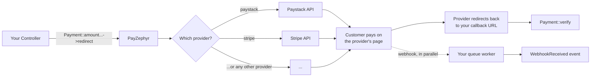

# PayZephyr

[](https://packagist.org/packages/kendenigerian/payzephyr)
[](https://packagist.org/packages/kendenigerian/payzephyr)
[](https://github.com/ken-de-nigerian/payzephyr/actions/workflows/tests.yml)
[](LICENSE)

## What is PayZephyr?

If you've ever had to accept payments in a Laravel app, you've probably run into this problem: every payment provider (Stripe, PayPal, Paystack, and the rest) has its own SDK, its own way of creating a charge, its own webhook format, and its own quirks. Wire your app up to one provider, and you're locked into rewriting a chunk of it if you ever need to add a second, or switch.

PayZephyr solves that by giving you **one API that works the same way no matter which provider is behind it.** You write:

```php
Payment::amount(100.00)->email('customer@example.com')->redirect();
```

and PayZephyr handles the fact that, underneath, this might be talking to Paystack today and Stripe tomorrow. You don't write provider-specific code, and you don't have to think about it again until you actually need to: for example, if a provider goes down and you want to fail over to another one automatically, which PayZephyr also does for you.

<!-- generated:provider-list:start -->
**Currently supported providers:** Flutterwave, Mollie, Monnify, OPay, Paddle, PayPal, Paystack, Razorpay, Square, and Stripe.
<!-- generated:provider-list:end -->

## When a payment goes wrong, you get the whole story

Every payment library can tell you a charge succeeded. PayZephyr can tell you **what happened on
the way there** - including the parts that left no other trace.

Say a customer's payment came through, eventually. Your transactions table says
`provider: stripe, status: success`. True, and complete, and it tells you nothing about the fact
that Paystack was tried first, failed its health check, and was skipped - because that attempt
never existed anywhere durable. Turn tracing on and it does:

```
14:22:07.104 • payment.initiated          chain: paystack, stripe
14:22:07.106 • provider.skipped           paystack - failed_health_check
14:22:07.241 → provider.request.sent      stripe   POST /v1/checkout/sessions
14:22:08.402 ← provider.response.received stripe   HTTP 200   1161ms
14:22:08.404 • payment.completed          stripe
```

One append-only row per step, keyed by the reference you already have, redacted before it is
written, and readable from the command line:

```bash
php artisan payzephyr:trace PZ_1758000000_ab12cd
```

This is the part that is genuinely hard to add afterwards. Normalizing providers behind one API
is table stakes - several packages do it. Reconstructing *why* a payment took the path it took,
across a fallback chain, with per-attempt correlation IDs and millisecond gaps, is the thing you
cannot bolt on once the decisions have already been made and forgotten.

It is off by default, costs nothing when off, and can be turned off again on the next request
with no deploy. **Today it covers charges, verifications and inbound webhooks.** Refunds and
subscriptions are not instrumented yet - that is planned, not shipped, and
[Tracing](docs/tracing.md) says so where you would look for it.

## Is this for you?

PayZephyr is a good fit if:

- You're building a Laravel app that needs to accept one-time payments, recurring subscriptions, or both.
- You want to support more than one payment provider (or might in the future) without duplicating your checkout logic.
- You want webhook signature verification, replay-attack protection, and transaction logging handled for you instead of hand-rolled per provider.

It's **not** trying to be a full accounting or invoicing system; it's a payment abstraction layer. Refunds are supported (see [Refunds](docs/refunds.md)), but full accounting/ledger reconciliation is out of scope.

## How it fits together



Two things happen when a customer pays: they get redirected back to your app (so you can show a "thank you" page), *and* the provider sends your app a webhook in the background (so your database stays correct even if the customer closes their browser before the redirect completes). PayZephyr handles both paths: the [Understanding Payment Flow](docs/payment-flow.md) chapter walks through exactly what happens at each step.

## Pick a provider, get everything

The point of PayZephyr is that choosing a provider is the *only* decision you make. Everything
else is already built.

Switch from Paystack to Stripe and you change one line in `.env`. Your checkout code does not
change. Neither does your webhook handling, your retry safety, or your database schema.

The same is true for a provider PayZephyr does not ship with. Write a driver, and it inherits
all of this without you implementing any of it:

| You get, automatically | Meaning |
| --- | --- |
| Automatic fallback | Provider down? The next one takes over. |
| Double-charge protection | The safety rules that stop a customer paying twice apply to your driver too. |
| Retry safety | A request that timed out is never quietly retried somewhere else. |
| Webhook verification | Signature checking and replay protection. |
| Transaction logging | Every payment recorded, in the same tables. |
| Events | The same events fire, so your listeners keep working. |
| Health checks | Cached, so a slow provider does not slow every charge. |
| Secret-safe logging | Keys and tokens stripped before anything is written. |
| Tracing | Extend `AbstractDriver` and your HTTP round trips appear on the same timeline as everyone else's. |

You write what is genuinely specific to your provider: how to build its request, and how to read
its response. That is the part nobody else can write for you.

Adding refunds or subscriptions later is opt-in, one interface at a time. A provider that cannot
do refunds is not a broken driver, and PayZephyr says so clearly rather than failing strangely.

See [Custom Drivers](docs/custom-drivers.md) to build one, then
[Extending a Driver](docs/extending-drivers.md) to add refunds and subscriptions.

## Quick Start

This gets you from zero to a working payment in about five minutes. For the full walkthrough with explanations of *why* each step matters, see [Your First Payment](docs/first-payment.md).

**1. Install the package and run the setup command:**

```bash
composer require kendenigerian/payzephyr
php artisan payzephyr:install
```

`payzephyr:install` copies PayZephyr's configuration file into your app (so you can edit it), copies the core database migrations it always needs (for transaction logging), asks whether you also want Subscriptions and/or Refunds, and offers to run the migrations for you. See [Installation](docs/installation.md#core-vs-optional-features) for exactly which tables are core vs. optional, and how to select features non-interactively with `--all`/`--features=`. A matching `php artisan payzephyr:uninstall` removes what PayZephyr installed - see [Uninstalling PayZephyr](docs/installation.md#uninstalling-payzephyr).

**2. Add your provider's credentials to `.env`.** Paystack is enabled by default. Grab your test keys from your Paystack dashboard:

```env
PAYSTACK_SECRET_KEY=sk_test_xxxxx
PAYSTACK_PUBLIC_KEY=pk_test_xxxxx
PAYSTACK_ENABLED=true
```

**3. Start a payment:**

```php
use KenDeNigerian\PayZephyr\Facades\Payment;

Route::get('/checkout', function () {
    return Payment::amount(500.00)
        ->email('customer@example.com')
        ->callback(route('payment.callback'))
        ->redirect();
});
```

**4. Verify it when the customer comes back:**

```php
use KenDeNigerian\PayZephyr\Facades\Payment;

Route::get('/payment/callback', function (\Illuminate\Http\Request $request) {
    $verification = Payment::verify($request->query('reference'));

    if ($verification->isSuccessful()) {
        return 'Payment succeeded! Reference: '.$verification->reference;
    }

    return 'Payment did not go through.';
})->name('payment.callback');
```

That's a working payment flow. It's also incomplete on its own: webhooks are what make it *reliable* (a customer closing their browser tab shouldn't mean you never find out they paid). Read on.

## Documentation

The chapters below are written to be read roughly in order if you're new to PayZephyr; each one builds on the last. If you already know what you're looking for, jump straight there.

**Getting started**

1. [Installation](docs/installation.md): every way to install PayZephyr, explained
2. [Configuration](docs/configuration.md): what every config option does and when to change it
3. [Your First Payment](docs/first-payment.md): a complete, working example built step by step
4. [Understanding Payment Flow](docs/payment-flow.md): what actually happens between "customer clicks pay" and "money in your account"
5. [Payment Verification](docs/verification.md): confirming a payment actually succeeded, correctly

**Core features**

6. [Subscriptions](docs/subscriptions.md): recurring billing, supported on most bundled providers
7. [Refunds](docs/refunds.md): full and partial refunds, supported on every bundled provider
8. [Tracing](docs/tracing.md): the step-by-step record of why a payment took the path it took
9. [Webhooks](docs/webhooks.md): why they exist and how to handle them
10. [Events](docs/events.md): every event PayZephyr fires and how to listen for it
11. [Testing](docs/testing.md): testing code that charges money, without charging money
12. [Error Handling](docs/error-handling.md): what can go wrong and how PayZephyr tells you
13. [Security](docs/security.md): webhook verification, replay protection, and what PayZephyr does *not* protect you from
14. [Queues](docs/queues.md): why a queue worker is required, not optional

**Going further**

15. [Multiple Providers](docs/providers.md): per-provider setup, currencies, and feature support
16. [Custom Drivers](docs/custom-drivers.md): adding a provider PayZephyr doesn't support yet
17. [Extending a Driver](docs/extending-drivers.md): add refunds and subscriptions to a custom driver
18. [Advanced Usage](docs/advanced-usage.md): direct driver access, health checks, idempotency patterns

**Shipping it**

19. [Production Checklist](docs/production-checklist.md): what to double-check before going live
20. [Deployment](docs/deployment.md): migrations, environment variables, monitoring
21. [Upgrade Guide](docs/upgrade-guide.md): moving between major versions

**When things go wrong**

22. [Troubleshooting](docs/troubleshooting.md): common problems, their causes, and their fixes
23. [FAQ](docs/faq.md)

**Reference**

24. [API Reference](docs/api-reference.md): every public method, documented
25. [Architecture](docs/architecture.md): how the package is put together internally
26. [Contributing](docs/contributing.md)

The full table of contents, if you'd rather browse than read linearly, is in [docs/INDEX.md](docs/INDEX.md).

## Changelog

The current release is **v3.0.0**. See [CHANGELOG.md](docs/CHANGELOG.md) for the full version history.

**v3.0.0 contains one breaking change.** If you bind your own implementation of
`WebhookEventRepositoryInterface`, it now needs a `forget()` method. If you don't (and most
apps don't), upgrading needs no code changes from you. The [Upgrade Guide](docs/upgrade-guide.md)
walks through it.

## License

MIT. See [LICENSE](LICENSE).

## Support

If PayZephyr is useful to you, starring the repository helps other people find it. Contributions (code, documentation, bug reports) are welcome; see [Contributing](docs/contributing.md).

---

**Built for the Laravel community by [Ken De Nigerian](https://github.com/ken-de-nigerian)**
