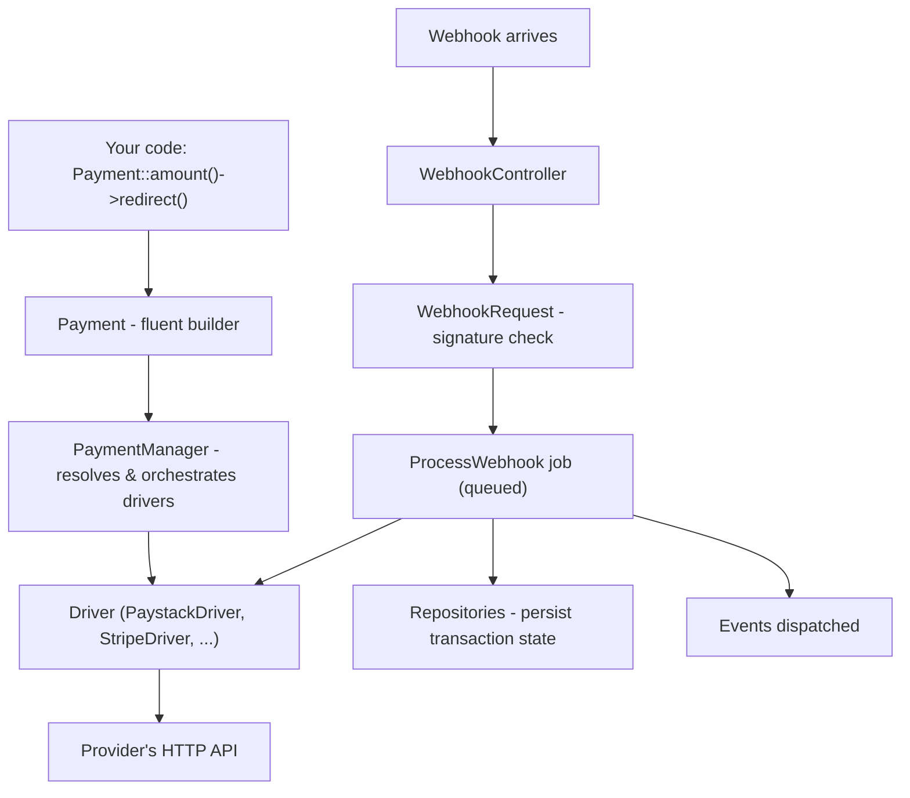

# Architecture

This chapter is for understanding how PayZephyr is built internally — useful if you're building a [custom driver](custom-drivers.md), debugging something unexpected, or just curious how the pieces fit together. You don't need any of this to *use* PayZephyr; the earlier chapters cover that.

## The layers



**`Payment`** is the fluent builder you interact with directly — `amount()`, `email()`, `redirect()`, and so on. It doesn't talk to providers itself; it collects everything you configure into a `ChargeRequestDTO` and hands it to `PaymentManager`.

**`PaymentManager`** is the orchestration layer: it resolves which driver(s) to use (your explicit choice, or the configured default/fallback), constructs driver instances from `config/payments.php`, and implements the [automatic fallback](providers.md#automatic-fallback) logic — trying the next provider in your list if the first one's request fails.

**Drivers** (`PaystackDriver`, `StripeDriver`, and so on, in `src/Drivers/`) are where provider-specific logic actually lives — each one translates PayZephyr's unified `ChargeRequestDTO`/`VerificationResponseDTO` shapes into that provider's own API calls and response format. Every driver extends `AbstractDriver`, which handles the shared plumbing (HTTP client, logging, currency validation) so each concrete driver only implements what's genuinely provider-specific. See [Custom Drivers](custom-drivers.md) for the exact contract.

**Webhook processing** is a separate path: `WebhookController` receives the raw HTTP request, `WebhookRequest` (a Laravel form request) handles synchronous signature verification where the provider supports it, and the actual processing — deduplication, transaction updates, event dispatch — happens inside `ProcessWebhook`, a queued job. See [Webhooks](webhooks.md) and [Queues](queues.md) for why this is split this way.

**Repositories** (`src/Repositories/`) sit between the webhook job and the database, handling concurrency-safe reads/writes to `payment_transactions`, `subscription_transactions`, and `webhook_events` — this is where duplicate-webhook detection and race-condition-safe updates are implemented (see the [ADRs](#why-things-are-built-this-way) below for the reasoning).

## Directory structure

```
src/
├── Payment.php               ← the fluent builder (start here)
├── Subscription.php          ← subscription fluent builder
├── SubscriptionQuery.php     ← subscription search/filter builder
├── PaymentManager.php        ← driver resolution + fallback orchestration
├── PaymentServiceProvider.php ← registers routes, config, bindings
├── Drivers/                  ← one class per provider
├── Contracts/                ← interfaces (DriverInterface, SupportsSubscriptionsInterface, ...)
├── DataObjects/               ← the typed DTOs every method returns
├── Events/                   ← everything PayZephyr dispatches
├── Exceptions/                ← the exception hierarchy
├── Http/
│   ├── Controllers/          ← WebhookController
│   ├── Requests/              ← WebhookRequest (signature verification)
│   └── Middleware/            ← HealthEndpointMiddleware
├── Jobs/
│   └── ProcessWebhook.php    ← the queued webhook-processing job
├── Models/                   ← PaymentTransaction, SubscriptionTransaction, WebhookEvent
├── Repositories/              ← concurrency-safe persistence
├── Services/                  ← StatusNormalizer, MetadataSanitizer, ChannelMapper, ...
├── Traits/                    ← shared behavior mixed into drivers (webhook validation, log sanitization, ...)
└── Console/
    └── InstallCommand.php    ← php artisan payzephyr:install
```

## Why a fluent builder instead of passing arrays or DTOs directly

`Payment::amount(100)->email('a@b.com')->redirect()` reads close to plain English, and — more importantly for a package with eight providers — the builder methods are the same regardless of which provider ends up handling the request. If PayZephyr instead required you to construct a `ChargeRequestDTO` by hand and pass it to a provider-specific method, adding a ninth provider (or your own [custom driver](custom-drivers.md)) would mean learning a new call shape rather than reusing muscle memory you already have.

## Why drivers extend an abstract base rather than each being fully independent

Every provider needs the same handful of things — an HTTP client, request logging, currency validation, idempotency-key handling — and duplicating that across eight classes would mean eight places to fix the same bug if one of those shared behaviors needed to change. `AbstractDriver` exists so each concrete driver's code is almost entirely the parts that are *actually* different about that provider: its request/response shapes and its webhook signature scheme.

## Why webhook processing is queued rather than synchronous

Covered in depth in [Queues](queues.md) — the short version is that some providers' verification requires an extra outbound API call, and providers generally expect a fast response to the webhook delivery itself; deferring the actual work to a queue keeps the HTTP response fast regardless of how long your own listener code takes.

## Why things are built this way

Significant architectural decisions in PayZephyr are recorded as Architecture Decision Records (ADRs) in `docs/architecture/adr/` — each one documents a specific problem, the options considered, and why a particular approach was chosen, at the time it was chosen. If you're curious about the reasoning behind something specific — why webhook event deduplication works the way it does, why PayPal's webhook verification is asynchronous, why Mollie's subscription codes are composite strings — the ADRs are the primary source, more detailed than what fits in a user-facing chapter. They're written to stay accurate as historical record even after the code around them evolves, so treat them as "why this decision was made then," not necessarily "the current state of everything" — for current behavior, trust the numbered chapters in this documentation set.

## Next steps

- [Custom Drivers](custom-drivers.md) — put this architecture into practice by building one
- [Contributing](contributing.md) — the development workflow, including how new ADRs get written
