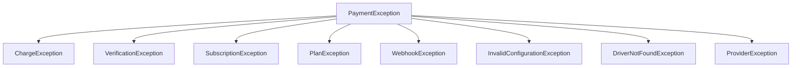

# Error Handling

## Why PayZephyr uses specific exception types instead of one generic one

Every operation PayZephyr performs can fail for a different *kind* of reason — a charge can fail because a card was declined, verification can fail because the provider's API is unreachable, a subscription can fail because a plan doesn't exist. If PayZephyr threw the same generic exception for all of these, your `catch` block would have no way to tell them apart except by parsing the error message string — fragile, and easy to get subtly wrong.

Instead, every exception PayZephyr throws extends a common base, `PaymentException`, but the *specific* class tells you what kind of operation failed:



This means you can catch broadly (`catch (PaymentException $e)`) when you don't care which specific thing went wrong, or narrowly (`catch (ChargeException $e)`) when you need to handle one failure mode differently from another — for example, showing "your card was declined" specifically for a charge failure, versus "we couldn't process your request" for something more generic.

## The exceptions, and when each one is thrown

| Exception | Thrown when |
|---|---|
| `ChargeException` | `Payment::charge()` or `->redirect()` fails — the provider rejected the charge, or the request to create it failed |
| `VerificationException` | `Payment::verify()` can't get a definitive answer from the provider (network failure, invalid reference) |
| `SubscriptionException` | A subscription operation fails — creating, cancelling, enabling, or fetching one |
| `PlanException` | A plan operation fails — creating, updating, fetching, or listing plans |
| `WebhookException` | Internal webhook-processing failure |
| `InvalidConfigurationException` | A provider is missing required configuration (see [Configuration](configuration.md#provider-credentials)) — this is a setup mistake, not something to catch at runtime; fix your `.env` instead |
| `DriverNotFoundException` | You referenced a provider name PayZephyr doesn't recognize, or that isn't enabled |
| `ProviderException` | A lower-level provider-communication failure that doesn't fit the categories above |

Two of these — `InvalidConfigurationException` and `DriverNotFoundException` — are really configuration bugs, not conditions you should be catching and handling gracefully in production. If you're seeing them outside of local development, the fix is almost always in your `.env` or `config/payments.php`, not in a `try`/`catch` block. See [Troubleshooting](troubleshooting.md#provider-not-found) if you hit one unexpectedly.

## A realistic handling pattern

```php
use KenDeNigerian\PayZephyr\Facades\Payment;
use KenDeNigerian\PayZephyr\Exceptions\ChargeException;
use KenDeNigerian\PayZephyr\Exceptions\DriverNotFoundException;

public function buy(Request $request)
{
    try {
        return Payment::amount(15.00)
            ->email($request->input('email'))
            ->callback(route('checkout.callback'))
            ->redirect();
    } catch (ChargeException $e) {
        // The provider itself rejected this specific charge - tell the
        // customer something went wrong with *their* payment attempt.
        report($e);
        return back()->with('error', 'We could not start your payment. Please try again.');
    } catch (DriverNotFoundException $e) {
        // A configuration problem, not a customer-facing failure - this
        // means a provider isn't set up correctly. Alert yourself, don't
        // blame the customer for it.
        report($e);
        return back()->with('error', 'Payments are temporarily unavailable. We have been notified.');
    }
}
```

Notice the two `catch` blocks respond differently — one is a normal, expected failure mode you show the customer a friendly message for; the other represents a bug in your own setup that you want to know about, not something the customer caused.

## Using exception context

Every `PaymentException` (and its subclasses) can carry structured context — extra data about what was happening when the failure occurred, beyond just the message string:

```php
try {
    Payment::amount(15.00)->email('customer@example.com')->charge();
} catch (\KenDeNigerian\PayZephyr\Exceptions\ChargeException $e) {
    Log::error('Charge failed', [
        'message' => $e->getMessage(),
        'context' => $e->getContext(), // e.g. ['method' => 'POST', 'uri' => 'charge', 'provider' => 'paystack']
    ]);
}
```

Not every exception sets context — it's populated where PayZephyr has something structured worth attaching (a network error, for instance, includes the HTTP method and endpoint it was calling). Where it's empty, `getContext()` just returns `[]`.

## Verification specifically needs different handling than "did it fail"

This is worth repeating from [Payment Verification](verification.md), because it trips people up: `VerificationException` being thrown is **not** the same thing as `$verification->isFailed()` being true.

- `$verification->isFailed() === true` means the verification request *succeeded* — PayZephyr got a definitive answer from the provider, and that answer was "no, this payment didn't go through." You can tell the customer their payment failed with confidence.
- A thrown `VerificationException` means PayZephyr *couldn't get an answer at all* — the provider's API was unreachable, timed out, or something else went wrong with the check itself. You genuinely don't know whether the payment succeeded or not. Telling a customer "your payment failed" in this case might be wrong — their card could have actually been charged.

```php
try {
    $verification = Payment::verify($reference);

    if ($verification->isSuccessful()) {
        // definitely paid
    } elseif ($verification->isFailed()) {
        // definitely did not pay
    } else {
        // pending - still processing, check again later
    }
} catch (VerificationException $e) {
    // we don't know - don't guess. Log it, and either retry later
    // or ask the customer to contact support with their reference.
    report($e);
}
```

## What happens to exceptions inside webhook processing

You generally don't need to catch exceptions yourself inside a `WebhookReceived` listener the way you would in a controller — if your listener throws, Laravel's queue system catches it, logs it, and retries the underlying job according to your queue configuration (see [Configuration](configuration.md#webhook-settings) for `max_retries`/`retry_backoff`). That said, an exception escaping your listener does mean that specific webhook delivery's processing is incomplete until a retry succeeds, so it's still worth wrapping anything you know can legitimately fail (an external API call inside your listener, for instance) in your own try/catch if you want more control over the failure behavior than "retry the whole job."

## Next steps

- [Troubleshooting](troubleshooting.md) — specific error messages and what to do about them
- [Testing](testing.md) — simulating provider failures in your test suite
