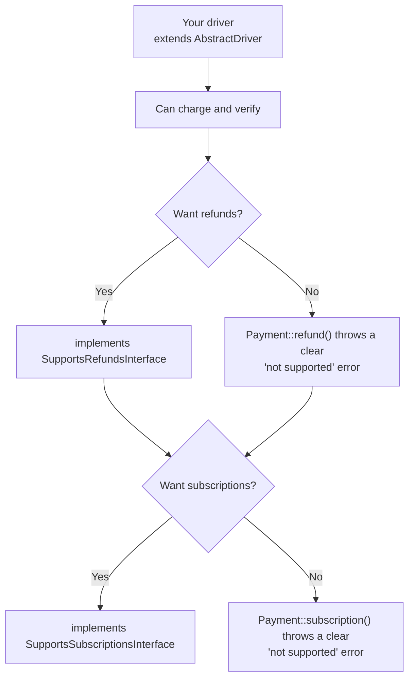
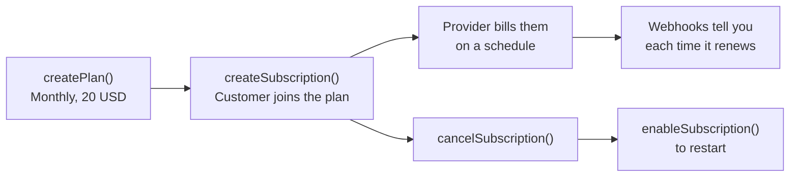

# Extending a Driver: Refunds and Subscriptions

A driver starts out able to do two things: take a payment, and check whether it worked. That is
enough for a lot of applications.

When you want more, you add it one capability at a time. You do not rewrite the driver, and you
do not touch PayZephyr's own code. You add an interface, and PayZephyr starts routing that
feature to you.

This chapter shows exactly how, with nothing left to guess.

> **New to writing drivers?** Read [Custom Drivers](custom-drivers.md) first. It covers the base
> driver: charge, verify, and webhooks. This chapter picks up from there.

## The idea in one picture



Nothing breaks when you say no. A provider that cannot do refunds is not a broken driver, it is
a driver that does not do refunds, and PayZephyr tells your users that clearly instead of
failing in a confusing way.

## What you get for free

This is the part that matters most, and it is easy to miss.

The moment your class extends `AbstractDriver`, you inherit all of this without writing a line
of it:

| You get | What it does for you |
| --- | --- |
| HTTP client | A configured Guzzle client, with your base URL, your auth headers, and TLS verification that cannot be turned off |
| Timeouts | Applied to every request from your `timeout` config |
| Idempotency headers | Added to outgoing charge requests automatically |
| Reference generation | `generateReference('ACME')` produces unique, correctly formatted references |
| Status normalisation | Your provider's wording (`SUCCESSFUL`, `paid`, `COMPLETED`) mapped to PayZephyr's standard statuses |
| Currency checking | `isCurrencySupported()` from your configured currency list |
| Health checks | Cached, so PayZephyr does not hammer your provider before every charge |
| Logging | `$this->log()` writes to PayZephyr's payment log channel with secrets stripped out |
| Webhook field extraction | Sensible defaults for pulling reference, status, and event id out of a payload |
| Channel mapping | Standard payment-method names translated to your provider's spelling |

And once your driver is registered, these work with it automatically:

- **Automatic fallback.** If your provider is down, PayZephyr moves to the next one.
- **Double-charge protection.** The safety rules in [Idempotency](idempotency.md) apply to your driver too. You do not implement them.
- **Retry safety.** If a request to your provider times out, PayZephyr will not quietly retry it somewhere else.
- **Transaction logging.** Every charge through your driver is recorded like any other.
- **Events.** Your driver's payments fire the same events as everyone else's.

You write the part that is genuinely specific to your provider. PayZephyr handles the rest.

---

# Part 1: Adding refunds

## Step 1: declare it

Two changes to your class:

```php
use KenDeNigerian\PayZephyr\Contracts\SupportsRefundsInterface;
use KenDeNigerian\PayZephyr\Traits\LogsRefundTransactions;

final class AcmepayDriver extends AbstractDriver implements SupportsRefundsInterface
{
    use AcmepayRefundMethods;

    protected string $name = 'acmepay';
}
```

Putting the refund code in its own trait is a convention, not a requirement. Every built-in
driver does it because refund code is long enough to crowd out the charge logic. You can put
the methods directly in the class if you prefer.

## Step 2: the two methods you must write

`SupportsRefundsInterface` asks for exactly two:

```php
public function refund(RefundRequestDTO $request): RefundResponseDTO;
public function fetchRefund(string $refundReference): RefundResponseDTO;
```

### What arrives in `RefundRequestDTO`

| Property | Type | Meaning |
| --- | --- | --- |
| `transactionReference` | `string` | The original charge being refunded. Always present. |
| `amount` | `?float` | How much to refund. `null` means refund everything. |
| `currency` | `?string` | Three-letter code, uppercased. May be `null`. |
| `reason` | `?string` | Optional human explanation. |
| `metadata` | `array` | Whatever the caller attached. |
| `idempotencyKey` | `?string` | Use this so a retry does not refund twice. |

There is also `$request->getAmountInMinorUnits()`, which returns the amount in cents/kobo as an
integer, or `null` if no amount was given. Use it if your provider wants minor units.

### What you must return

```php
new RefundResponseDTO(
    refundReference: 'the provider refund id',
    transactionReference: $request->transactionReference,
    status: 'pending',
    amount: 25.00,
    currency: 'USD',
    reason: $request->reason,
    metadata: [],
    provider: $this->getName(),
);
```

`status` is the provider's own word for it. PayZephyr normalises it, so do not translate it
yourself.

## Step 3: a complete worked example

```php
namespace App\Payments\Traits;

use KenDeNigerian\PayZephyr\DataObjects\RefundRequestDTO;
use KenDeNigerian\PayZephyr\DataObjects\RefundResponseDTO;
use KenDeNigerian\PayZephyr\Exceptions\RefundException;
use Throwable;

trait AcmepayRefundMethods
{
    public function refund(RefundRequestDTO $request): RefundResponseDTO
    {
        try {
            $payload = array_filter([
                'charge_id' => $request->transactionReference,
                'amount' => $request->getAmountInMinorUnits(),
                'note' => $request->reason,
            ], fn ($value) => $value !== null);

            $options = ['json' => $payload];

            // Send the idempotency key if the caller gave you one. This is what
            // stops a retried request from refunding the customer twice.
            if ($request->idempotencyKey) {
                $options['headers'] = ['Idempotency-Key' => $request->idempotencyKey];
            }

            $data = $this->parseResponse($this->makeRequest('POST', '/v1/refunds', $options));

            // Never assume the response has what you expect. If the id is
            // missing, something went wrong, and saying so beats returning a
            // half-built object that breaks later.
            if (! isset($data['id'])) {
                throw new RefundException('Acmepay did not return a refund id.');
            }

            $response = new RefundResponseDTO(
                refundReference: (string) $data['id'],
                transactionReference: $request->transactionReference,
                status: $data['state'] ?? 'pending',
                amount: (float) ($data['amount'] ?? 0) / 100,
                currency: $data['currency'] ?? $request->currency ?? 'USD',
                reason: $request->reason,
                metadata: $request->metadata,
                provider: $this->getName(),
            );

            // Writes the refund to your refund_transactions table. This is what
            // makes the over-refund and duplicate guards work.
            $this->logRefund($request, $response);

            return $response;
        } catch (RefundException $e) {
            throw $e;
        } catch (Throwable $e) {
            $this->log('error', 'Refund failed', ['error' => $e->getMessage()]);

            throw new RefundException('Refund failed: '.$e->getMessage(), 0, $e);
        }
    }

    public function fetchRefund(string $refundReference): RefundResponseDTO
    {
        try {
            $data = $this->parseResponse(
                $this->makeRequest('GET', "/v1/refunds/$refundReference")
            );

            $response = new RefundResponseDTO(
                refundReference: $refundReference,
                transactionReference: (string) ($data['charge_id'] ?? ''),
                status: $data['state'] ?? 'pending',
                amount: (float) ($data['amount'] ?? 0) / 100,
                currency: $data['currency'] ?? 'USD',
                provider: $this->getName(),
            );

            $this->logRefundFromResponse($response);

            return $response;
        } catch (RefundException $e) {
            throw $e;
        } catch (Throwable $e) {
            throw new RefundException('Could not fetch refund: '.$e->getMessage(), 0, $e);
        }
    }
}
```

## The three rules for refund code

**1. Always throw `RefundException`, never anything else.**

PayZephyr inspects that exception type to decide whether a failed refund is safe to retry. If a
raw network error escapes, that check cannot run. The `catch (RefundException)` then
`catch (Throwable)` pattern above handles both cases: rethrow yours, wrap everything else.

**2. Never invent a value the provider did not send.**

If the provider does not tell you the currency, do not guess `USD`. Use the request's currency,
or your configured default. Guessing produces records that look right and are wrong.

**3. Decide what "no amount" means, and say so.**

Some providers treat a missing amount as "refund everything". Others reject the request. If
yours needs an explicit amount, fetch the original charge first and pass its total, and if that
lookup fails, throw a `RefundException` that tells the caller to pass an amount themselves.

## What happens if you skip refunds

Nothing breaks. `Payment::refund(...)->with('acmepay')->refund()` throws a `PaymentException`
saying that provider does not support refunds. Clear, and caught like any other error.

---

# Part 2: Adding subscriptions

Subscriptions are more work than refunds, because there are two things to manage instead of
one: **plans** (the recurring price) and **subscriptions** (a customer attached to a plan).

## The shape of it



## Step 1: declare it

```php
use KenDeNigerian\PayZephyr\Contracts\SupportsSubscriptionsInterface;

final class AcmepayDriver extends AbstractDriver implements
    SupportsRefundsInterface,
    SupportsSubscriptionsInterface
{
    use AcmepayRefundMethods;
    use AcmepaySubscriptionMethods;
}
```

## Step 2: the nine methods

`SupportsSubscriptionsInterface` asks for nine. They split cleanly into two groups.

### Plans

| Method | Returns | What it does |
| --- | --- | --- |
| `createPlan(SubscriptionPlanDTO $plan)` | `PlanResponseDTO` | Creates a recurring price |
| `updatePlan(string $planCode, array $updates)` | `PlanResponseDTO` | Changes an existing plan |
| `fetchPlan(string $planCode)` | `PlanResponseDTO` | Reads one plan back |
| `listPlans(?int $perPage, ?int $page)` | `array` of `PlanResponseDTO` | Lists plans, paginated |

### Subscriptions

| Method | Returns | What it does |
| --- | --- | --- |
| `createSubscription(SubscriptionRequestDTO $request)` | `SubscriptionResponseDTO` | Puts a customer on a plan |
| `fetchSubscription(string $subscriptionCode)` | `SubscriptionResponseDTO` | Reads one subscription back |
| `cancelSubscription(SubscriptionActionDTO $action)` | `SubscriptionResponseDTO` | Stops future billing |
| `enableSubscription(SubscriptionActionDTO $action)` | `SubscriptionResponseDTO` | Restarts it |
| `listSubscriptions(?int $perPage, ?int $page, ?string $customer)` | `array` of `SubscriptionResponseDTO` | Lists subscriptions, optionally for one customer |

## Step 3: the DTOs, field by field

### `SubscriptionPlanDTO` (arrives at `createPlan`)

| Property | Type | Notes |
| --- | --- | --- |
| `name` | `string` | Plan name |
| `amount` | `float` | Major units, so `20.00` means twenty dollars |
| `interval` | `string` | Exactly one of `daily`, `weekly`, `monthly`, `annually`. Anything else is rejected before your driver is called. |
| `currency` | `string` | Defaults to `NGN` |
| `description` | `?string` | Optional |
| `invoiceLimit` | `?int` | Stop after this many invoices |
| `sendInvoices` | `bool` | Provider-specific, ignore if yours has no equivalent |
| `sendSms` | `bool` | Same |
| `metadata` | `array` | Passed straight through |

Your provider almost certainly names intervals differently. Write a small mapper. You only ever
need to handle those four, because `SubscriptionPlanDTO` rejects anything else before your
driver runs:

```php
protected function mapInterval(string $interval): string
{
    return match (strtolower($interval)) {
        'daily' => 'DAY',
        'weekly' => 'WEEK',
        'monthly' => 'MONTH',
        'annually' => 'YEAR',
        default => throw new SubscriptionException("Acmepay cannot bill [$interval]."),
    };
}
```

Keep the `default` arm even though the DTO already validates. If your provider cannot do one of
the four, throwing is the right answer. Silently substituting a different billing frequency
would charge the customer on a schedule nobody asked for.

### `PlanResponseDTO` (you return it)

```php
new PlanResponseDTO(
    planCode: 'the provider plan id',
    name: $plan->name,
    amount: 20.00,
    interval: $plan->interval,
    currency: $plan->currency,
    description: $plan->description,
    invoiceLimit: $plan->invoiceLimit,
    metadata: $plan->metadata,
    provider: $this->getName(),
);
```

### `SubscriptionRequestDTO` (arrives at `createSubscription`)

| Property | Type | Notes |
| --- | --- | --- |
| `customer` | `string` | Customer identifier, usually email or provider customer id |
| `plan` | `string` | The plan code to attach them to |
| `quantity` | `?int` | Defaults to 1 |
| `startDate` | `?string` | Delay the first bill |
| `trialDays` | `?int` | Free period before billing starts |
| `metadata` | `array` | Passed through |
| `authorization` | `?string` | A saved payment method, if your provider uses one |
| `idempotencyKey` | `?string` | Send it, so a retry does not create two subscriptions |
| `callbackUrl` | `?string` | Where to send the customer if setup needs a redirect |

### `SubscriptionResponseDTO` (you return it)

```php
new SubscriptionResponseDTO(
    subscriptionCode: 'the provider subscription id',
    status: 'active',
    customer: $request->customer,
    plan: $request->plan,
    amount: 20.00,
    currency: 'USD',
    nextPaymentDate: '2026-09-01',
    emailToken: null,
    metadata: $request->metadata,
    provider: $this->getName(),
);
```

`subscriptionCode` is what your users pass to every later call, so it must be something you can
look a subscription back up with. If your provider needs two values to identify a subscription,
join them into one string (`"cus_123:sub_456"`) and split it again on the way in.

### `SubscriptionActionDTO` (arrives at cancel and enable)

Two properties: `subscriptionCode`, and an open `options` array for anything provider-specific.

```php
public function cancelSubscription(SubscriptionActionDTO $action): SubscriptionResponseDTO
{
    $token = $action->option('token'); // null if the caller did not set one
    // ...
}
```

This exists so providers that need an extra value at cancel time can have one, without forcing
every other driver to accept a parameter it has no use for.

## Step 4: a worked example

```php
public function createSubscription(SubscriptionRequestDTO $request): SubscriptionResponseDTO
{
    try {
        $options = ['json' => array_filter([
            'customer' => $request->customer,
            'plan_id' => $request->plan,
            'quantity' => $request->quantity,
            'trial_days' => $request->trialDays,
            'starts_at' => $request->startDate,
            'meta' => $request->metadata ?: null,
        ], fn ($value) => $value !== null)];

        if ($request->idempotencyKey) {
            $options['headers'] = ['Idempotency-Key' => $request->idempotencyKey];
        }

        $data = $this->parseResponse(
            $this->makeRequest('POST', '/v1/subscriptions', $options)
        );

        if (! isset($data['id'])) {
            throw new SubscriptionException('Acmepay did not return a subscription id.');
        }

        $response = new SubscriptionResponseDTO(
            subscriptionCode: (string) $data['id'],
            status: $data['state'] ?? 'active',
            customer: $request->customer,
            plan: $request->plan,
            amount: (float) ($data['amount'] ?? 0) / 100,
            currency: $data['currency'] ?? 'USD',
            nextPaymentDate: $data['next_billing_at'] ?? null,
            metadata: $request->metadata,
            provider: $this->getName(),
        );

        // Records it in subscription_transactions.
        $this->logSubscription($response);

        return $response;
    } catch (SubscriptionException $e) {
        throw $e;
    } catch (Throwable $e) {
        $this->log('error', 'Subscription creation failed', ['error' => $e->getMessage()]);

        throw new SubscriptionException('Could not create subscription: '.$e->getMessage(), 0, $e);
    }
}
```

Use `LogsSubscriptionTransactions` for `logSubscription()`, the same way refunds use
`LogsRefundTransactions`.

## Step 5: make renewals actually update your database

This is the step people forget.

Creating a subscription is one API call. **Everything after that happens on the provider's
schedule, and reaches you as webhooks.** If you do not handle them, your database will still
say "active" long after a customer's card has been declined.

Tell PayZephyr how to read your provider's subscription webhooks by overriding the extraction
methods:

```php
public function extractWebhookStatus(array $payload): string
{
    return $payload['event'] ?? 'unknown';
}

public function extractWebhookReference(array $payload): ?string
{
    return $payload['data']['subscription_id'] ?? null;
}
```

PayZephyr then dispatches `SubscriptionRenewed`, `SubscriptionPaymentFailed`, and
`SubscriptionCancelled` for you, and you listen for those. See [Subscriptions](subscriptions.md)
and [Webhooks](webhooks.md).

## Optional: lifecycle hooks

If you need to run your own code at specific moments, implement `SubscriptionLifecycleHooks`:

| Hook | When it fires |
| --- | --- |
| `beforeSubscriptionCreate` | Before creating. Can modify and return the request. |
| `afterSubscriptionCreate` | After a successful create. |
| `beforeSubscriptionCancel` | Before cancelling. |
| `afterSubscriptionCancel` | After a successful cancel. |
| `beforeSubscriptionRenewal` | When a renewal webhook arrives, before processing. |
| `afterSubscriptionRenewal` | After a renewal is processed. |
| `onSubscriptionRenewalFailed` | When a renewal fails. |

This is entirely optional. Skip it unless you have a specific need.

---

# Testing what you built

Same technique as everything else: hand your driver a fake HTTP client and assert what it does.

```php
use GuzzleHttp\Client;
use GuzzleHttp\Handler\MockHandler;
use GuzzleHttp\HandlerStack;
use GuzzleHttp\Psr7\Response;

it('refunds a charge', function () {
    $driver = new AcmepayDriver(['secret_key' => 'test', 'currencies' => ['USD']]);

    $driver->setClient(new Client(['handler' => HandlerStack::create(new MockHandler([
        new Response(200, [], json_encode([
            'id' => 'rf_1', 'state' => 'pending', 'amount' => 2500, 'currency' => 'USD',
        ])),
    ]))]));

    $refund = $driver->refund(RefundRequestDTO::fromArray([
        'transaction_reference' => 'ch_1',
        'amount' => 25.00,
        'currency' => 'USD',
    ]));

    expect($refund->refundReference)->toBe('rf_1')
        ->and($refund->amount)->toBe(25.00);
});
```

**Test the failures too, not just the happy path.** These are the ones that matter:

```php
it('throws a RefundException when the network dies', function () {
    $driver = new AcmepayDriver(['secret_key' => 'test', 'currencies' => ['USD']]);

    $driver->setClient(new Client(['handler' => HandlerStack::create(new MockHandler([
        new ConnectException('Timed out', new Request('POST', '/v1/refunds')),
    ]))]));

    expect(fn () => $driver->refund(RefundRequestDTO::fromArray([
        'transaction_reference' => 'ch_1',
    ])))->toThrow(RefundException::class);
});
```

At minimum, cover: a successful call, a provider error response, a network failure, and a
response missing the field you depend on.

## A checklist before you ship

- [ ] Every method throws the matching exception type (`RefundException`, `SubscriptionException`)
- [ ] Nothing invents a currency, amount, or status the provider did not send
- [ ] The idempotency key is sent wherever the provider accepts one
- [ ] `logRefund()` / `logSubscription()` are called so the guards work
- [ ] Webhook extraction methods are overridden if your payload shape is unusual
- [ ] Tests cover success, provider error, network failure, and malformed response
- [ ] Unsupported intervals throw instead of silently becoming a different billing period

## Next steps

- [Custom Drivers](custom-drivers.md): the base driver, if you skipped it
- [Refunds](refunds.md): how refunds behave from the user's side
- [Subscriptions](subscriptions.md): the same for subscriptions
- [Idempotency](idempotency.md): the safety rules your driver inherits
- [Testing](testing.md): more on mocking HTTP
