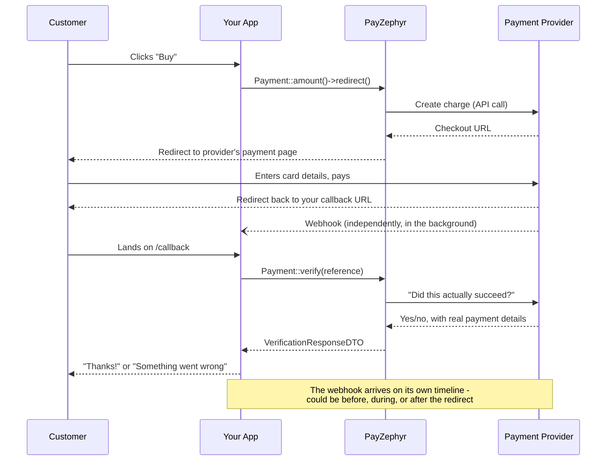
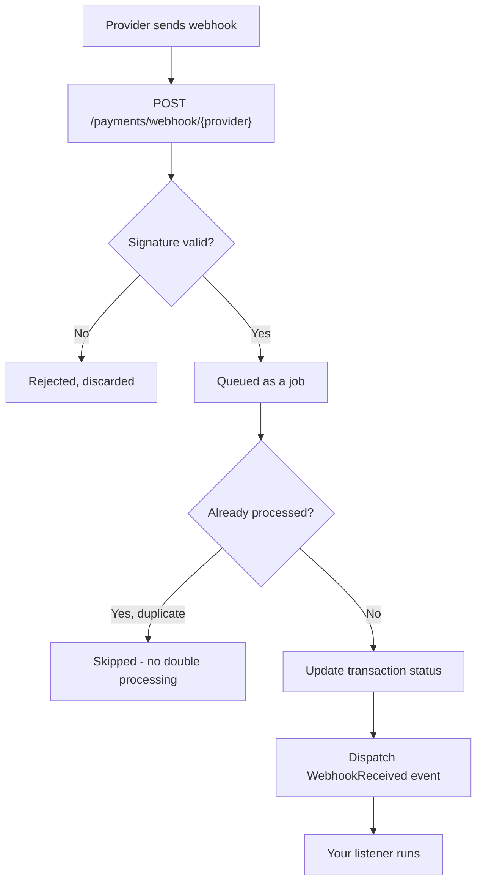

# Understanding Payment Flow

In [Your First Payment](first-payment.md), we built a working checkout using two pieces: starting a payment, and verifying it when the customer comes back. This chapter zooms out and shows the *complete* picture (including the piece that tutorial deliberately left out) so you understand exactly what's happening at each stage, and why each piece exists.

## The full sequence

Notice that **two independent things happen after the customer pays**: they get redirected back to your app, *and* the provider sends your app a webhook. These aren't the same event arriving twice: they're two separate mechanisms, and understanding why both exist is the key to this whole chapter.

## Why two mechanisms for one payment?

**The redirect is for the customer.** It's how you show them a "thank you" page, a receipt, or a "something went wrong, try again" message. It's driven by the customer's browser actually completing the round trip back to your site.

**The webhook is for your database.** It's the provider proactively telling your server "this payment succeeded" (or failed, or a subscription renewed, and so on), independent of whatever the customer's browser is doing. Here's the failure mode that makes this necessary: a customer completes payment successfully on the provider's page, then closes the browser tab before the redirect back to your app finishes loading: maybe their connection drops, maybe they're just impatient. If you *only* relied on the redirect/callback, your app would never find out that payment succeeded. Their money moved, but your database still thinks the order is `pending` forever.

The webhook doesn't have that problem, because it doesn't depend on the customer's browser at all: it's a server-to-server HTTP request the provider sends directly to your app.

| | Redirect / Callback | Webhook |
|---|---|---|
| **Who triggers it** | The customer's browser | The provider's server |
| **What it's for** | Showing the customer a result | Keeping your database correct |
| **Can it be skipped?** | Yes, customer can close the tab | No, the provider sends it regardless |
| **Should you trust its data directly?** | No, always re-verify (see below) | Yes, once signature-verified (see [Security](security.md)) |
| **When does it arrive** | Right after payment, synchronously | Independently, could be seconds or minutes later |

**The practical rule:** build your checkout's *user experience* around the redirect/callback (that's what gives the customer instant feedback), but build your *source of truth* (the thing that actually marks an order paid for good) around the webhook. The callback in [Your First Payment](first-payment.md) already calls `Payment::verify()` rather than trusting the redirect blindly, which covers you for the common case; adding a webhook handler (next chapter) covers the case where the redirect never happens at all.

## Why verify instead of trusting the redirect?

You might notice the callback route receives a `reference` as a query parameter, and wonder why we don't just... trust it. Two reasons:

1. **A redirect happening isn't proof of payment.** Providers redirect back to your callback URL whether the payment succeeded, failed, or was cancelled: the redirect itself carries no guarantee.
2. **Query parameters are trivially editable.** Anyone can construct a URL like `yourapp.com/checkout/callback?reference=SOMETHING&status=success` by hand. If your code trusted a `status=success` query parameter, anyone could "pay" for anything for free.

`Payment::verify($reference)` sidesteps both problems by asking the provider directly, over an authenticated API call, what actually happened to that specific reference. That response is the only thing PayZephyr treats as ground truth. [Payment Verification](verification.md) covers this in depth.

## Where webhooks fit into this architecture

A few things worth knowing about this before you build a handler:

- **Webhooks are verified before anything else happens**: an unsigned or incorrectly-signed request never reaches your application code. See [Security](security.md).
- **Processing happens on a queue**, not synchronously during the HTTP request: this is why a queue worker (`php artisan queue:work`) isn't optional for a production PayZephyr app. See [Queues](queues.md) for why.
- **Providers routinely send the same webhook more than once**: that's normal behavior on their end (a retry after a slow response from you, for instance), not a bug. PayZephyr deduplicates automatically so your listener only ever runs once per actual event.
- **You react to webhooks via a single Laravel event**, `WebhookReceived`, regardless of which provider sent it. Covered fully in [Webhooks](webhooks.md) and [Events](events.md).

## Next steps

Now that you know why both pieces exist, [Payment Verification](verification.md) covers `verify()` in more depth, and [Webhooks](webhooks.md) shows you how to actually add the webhook handler this flow relies on.
