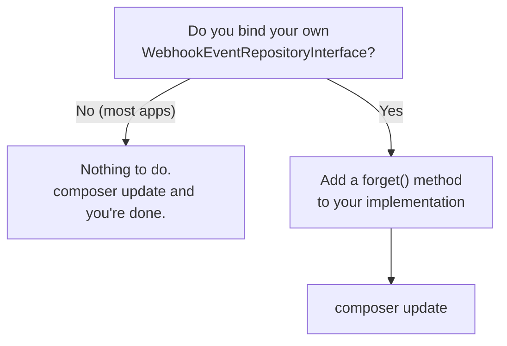

# Upgrade Guide

This chapter walks through what changes when you move between PayZephyr's major versions. For the complete, exhaustive list of every change (not just breaking ones), see [CHANGELOG.md](CHANGELOG.md): this chapter is the narrative, tutorial version of the same information, focused on *what you need to actually do*.

## Upgrading to the next major release (unreleased)

This release contains breaking changes, all of them in service of one rule: **PayZephyr no
longer invents a number when a provider does not send one.** Most apps that do not use
subscriptions need to do nothing. The full list is in the [CHANGELOG](CHANGELOG.md).

### If you use subscriptions: two required steps

**1. Make `subscription_transactions.amount` nullable.** New installs get this from the published
migration. An existing install needs a migration of its own, or the first metered subscription
will fail on insert:

```php
use Illuminate\Database\Migrations\Migration;
use Illuminate\Database\Schema\Blueprint;
use Illuminate\Support\Facades\Schema;

return new class extends Migration
{
    public function up(): void
    {
        Schema::table(config('payments.subscriptions.logging.table', 'subscription_transactions'), function (Blueprint $table) {
            $table->decimal('amount', 15)->nullable()->change();
        });
    }
};
```

**2. Handle a null amount.** `PlanResponseDTO::$amount`, `SubscriptionResponseDTO::$amount` and
`PlanResponseDTO::getAmountInMajorUnits()` are now `?float`. A null means the provider reported
no fixed price - a tiered, metered or usage-based plan. It is not zero, and treating it as zero
reintroduces exactly the bug this fixes: those customers appear to be paying nothing.

```php
$plan = Payment::subscription()->plan('price_123')->with('stripe')->fetchPlan();

$label = $plan->amount === null
    ? 'Priced by usage'
    : number_format($plan->amount, 2).' '.$plan->currency;
```

### If you call `updatePlan()`: check your intervals

`updatePlan()` now applies the same rules as `createPlan()` and refuses anything else *before*
contacting the provider. If you have been passing `'yearly'`, change it to `'annually'` - on
Stripe, Square, Mollie and PayPal, `'yearly'` was being billed **monthly**. It is worth checking
any plan previously updated that way in your provider's dashboard.

### Exceptions you may now see

| Where | Now throws | Used to | What to do |
|---|---|---|---|
| `verify()` | `VerificationException` naming a missing field | report an amount of 0.00 | Verify again; it means the answer was incomplete, not that payment failed |
| Refunds | `RefundException` naming a missing field | report a refund of 0.00 | Check the provider before retrying |
| Stripe refunds | `RefundException` | sometimes `ChargeException` | Catch `RefundException` |
| `updatePlan()` | `PlanException` | accept the update | Use one of the four intervals and an amount above zero |

### Reporting queries may return more rows than before

`PaymentTransaction::successful()`, `failed()` and `pending()` used to match hand-maintained
lists of status strings that had drifted from the normalizer. A row stored as `captured`,
`overpaid`, `paidout` or `complete` answered `true` to `$transaction->isSuccessful()` while
`PaymentTransaction::successful()` did not return it - so a reconciliation query built on the
scope silently under-counted. `captured` arrived with Razorpay; `overpaid` and `paidout` with
Mollie.

Both sides now derive from the same vocabulary. **If you reconcile revenue with
`PaymentTransaction::successful()->sum('amount')`, expect the figure to go up**, and to be
correct this time. Nothing changed about the rows themselves.

The status predicates also read the row's own `provider` column now. The same string can mean
different things - `APPROVED` is success for Square and pending for PayPal - and the predicates
previously ignored that, answering "none of the above" for any provider-specific status that
reached the column. The query scopes deliberately do **not** do this: across mixed providers, at
SQL level, the string alone cannot answer the question.

### If your webhook listeners are not idempotent, make them so

A worker killed mid-webhook - a job timeout, an OOM kill, a PHP fatal - used to leave its
idempotency marker behind, and the retry then mistook its own marker for a duplicate delivery and
discarded the webhook. A `charge.success` could be lost permanently, leaving the transaction
pending while the provider's dashboard showed a successful delivery.

A retry may now reclaim a marker left by its own earlier attempt. A genuine duplicate delivery
from the provider still skips, because it arrives as a new job on its first attempt.

The trade-off: **a reclaiming retry reprocesses, so an event a dead attempt already dispatched can
fire twice.** Queues are at-least-once, so listeners had to tolerate this already, but it is worth
checking any listener that sends email, charges something, or increments a counter. A duplicated
event is recoverable; a silently discarded payment confirmation is not.

### Config keys that no longer exist

None of these were ever read by the package, so removing them changes no behaviour. They are
listed so you can delete them from your `.env` rather than wonder why they do nothing:

| Removed | What people reasonably assumed it did |
|---|---|
| `PAYMENTS_SUBSCRIPTIONS_RETRY_ENABLED` / `_MAX_ATTEMPTS` / `_DELAY_HOURS` | Retried failed renewals. Nothing retried them |
| `PAYMENTS_SUBSCRIPTIONS_GRACE_PERIOD` | Kept access alive after a failed renewal |
| `PAYMENTS_SUBSCRIPTIONS_NOTIFICATIONS_ENABLED` | Sent subscription emails |
| `PAYMENTS_REFUNDS_NOTIFICATIONS_ENABLED` | Sent refund emails |
| `subscriptions.webhook_events`, `refunds.webhook_events` | Chose which webhook events were handled. The routing has always matched event names in code |

Renewal retry, grace periods and notifications remain your application's responsibility.
Subscribe to `SubscriptionRenewed` and `SubscriptionPaymentFailed` and decide there.

`health_check.enabled` went the other way: the package has always read it, defaulting to `true`,
but never declared it. It is now in the published config as
`PAYMENTS_HEALTH_CHECK_ENABLED`. Same default, same behaviour - you can now see it and switch it.

### If you run with webhook signature verification disabled

`PAYMENTS_WEBHOOK_VERIFY_SIGNATURE=false` now writes an `error`-level log, once an hour, outside
`local` and `testing`. Nothing else changed, and the switch still works. If those lines are new
in your production logs, they are not a new fault - they are describing an endpoint that will
accept a forged `charge.success` from anyone who can reach it. See [Security](security.md).

### Razorpay: an unusable idempotency key is now refused

Passing `idempotencyKey` to a Razorpay refund used to drop the key and send the refund anyway
when it did not match Razorpay's format, which left the caller believing a retry was protected
against double-refunding when nothing would deduplicate it. It now throws `RefundException`
before anything is sent. Keys must be at least 10 characters of letters, digits, hyphens or
underscores.

## Upgrading to v3.0.0

Most applications upgrade to v3.0.0 with **no code changes at all**. There is one breaking
change, and it only affects you if you have replaced one of PayZephyr's internal pieces with
your own.

### Do you need to do anything? Start here



If you have never heard of `WebhookEventRepositoryInterface`, the answer is no. You are in the
first branch, and you can skip the rest of this section.

### The breaking change: `WebhookEventRepositoryInterface::forget()`

This interface is how PayZephyr remembers which webhooks it has already handled, so a provider
sending the same webhook twice does not cause you to ship an order twice. It now requires one
extra method:

```php
public function forget(string $provider, string $eventKey): void;
```

**Why it was added.** PayZephyr marks a webhook as "seen" *before* it processes it, so that two
copies arriving at the same moment cannot both get through. The problem: if processing then
failed halfway, the mark stayed. Every retry looked at the mark, decided "already handled", and
skipped. The webhook could never succeed, and the queue's own retry setting silently did
nothing. `forget()` clears the mark when processing fails, so a retry gets a real second chance.

**If you use the built-in repository (the default), you do not need to do anything.** The
bundled `EloquentWebhookEventRepository` already has this method.

**If you wrote your own**, add it. Deleting the row for that provider and event key is all it
needs to do:

```php
public function forget(string $provider, string $eventKey): void
{
    WebhookEvent::where('provider', $provider)
        ->where('event_key', $eventKey)
        ->delete();
}
```

### One behaviour change worth knowing about

This is not breaking, but the data your app sees will change.

For **PayPal** and **Square**, the `channel` field on a transaction now reports the payment
method the customer actually used. Before, PayPal always recorded the literal text `paypal`,
and Square recorded `card` whenever it was unsure.

| Provider | Before | Now |
| --- | --- | --- |
| PayPal | always `paypal` | `card`, `paypal`, `venmo`, and so on, or `null` if PayPal did not say |
| Square | `card` when unknown | the real source type, or `null` if Square did not say |

The old values were guesses. The new ones are what the provider reported, and `null` honestly
means "not stated" instead of inventing an answer.

**What to check:** if any of your code reads `channel` and assumes it is never empty, it now
needs to handle `null`. If you only display the value, nothing breaks.

### Everything else in v3.0.0 is a fix

v3.0.0 is mainly a payment-safety release. Several situations that could charge or refund a
customer twice were found and fixed. Those fixes need nothing from you: upgrade and you have
them. The [changelog](CHANGELOG.md) lists each one.

---

## Upgrading to v2.0.0

v2.0.0 contains real breaking changes. Read this whole section before running `composer update` on a production app.

### Laravel 10.x and 11.x are no longer supported

PayZephyr now requires Laravel 12.x or 13.x. This isn't a preference: both Laravel 10 (security fixes ended 2025-02-04) and Laravel 11 (security fixes ended 2026-03-12) are now past their upstream security-fix window, meaning Composer's advisory-blocking policy refuses to install them at all once every version in the range has at least one permanently-unpatched advisory. Continuing to claim support for versions that can't receive security patches isn't defensible for a payments package.

**What to do:** upgrade your application to Laravel 12.x or 13.x before upgrading PayZephyr to v2.0.0. If you're not ready to move off Laravel 10/11, stay on PayZephyr v1.x; it will keep working, just without v2.0.0's new features.

### NOWPayments has been removed entirely

If you were using the `nowpayments` provider, it's gone, not deprecated, not soft-disabled, removed: the driver class, its config block, and everything referencing it. This was a deliberate product decision (crypto payment support is no longer in scope for PayZephyr), not a technical migration with a drop-in replacement.

**What breaks:** `PAYMENTS_DEFAULT_PROVIDER=nowpayments` or `PAYMENTS_FALLBACK_PROVIDER=nowpayments` in your `.env`, or any code calling `Payment::with('nowpayments')`.

**What to do:** remove NOWPayments from your `.env` and switch to one of the [other supported providers](providers.md). There's no automatic migration path: if you need crypto payments, PayZephyr v2.0.0 isn't the right tool for that anymore.

### Subscription cancel/enable now take a DTO instead of raw parameters

If you were calling a driver's `cancelSubscription()`/`enableSubscription()` directly (not through the `Subscription` fluent builder, see below), the signature changed:

```php
// Before (v1.x)
$driver->cancelSubscription($subscriptionCode, $token);

// After (v2.0.0)
use KenDeNigerian\PayZephyr\DataObjects\SubscriptionActionDTO;

$driver->cancelSubscription(new SubscriptionActionDTO($subscriptionCode, ['token' => $token]));
```

This changed because `$token` was specific to Paystack's cancellation flow, but the old signature forced every other provider's driver to accept a parameter it had no use for. `SubscriptionActionDTO` carries an open bag of provider-specific options instead, read via `$action->option('token')`.

**If you were using the public fluent API** (`Payment::subscription($code)->token($token)->cancel()`), **this doesn't affect you at all**: that method's own signature didn't change; only direct driver-interface callers and custom driver implementations need to update. See [Subscriptions](subscriptions.md#cancelling-and-re-enabling) for the current recommended way to do this.

### PayPal webhook signature verification is now asynchronous

A request with an invalid PayPal webhook signature now receives `202 Accepted` (queued for processing) instead of an immediate rejection response: the actual verification now happens inside the queued webhook-processing job, and invalid deliveries are discarded there instead of at the HTTP layer.

**What this means for you:** if you had any code or monitoring specifically watching for a synchronous rejection status code on PayPal's webhook endpoint, update it to account for verification happening asynchronously instead. Functionally, invalid webhooks are still rejected, just one step later in the pipeline. This also removed two outbound HTTP calls from the webhook request/response cycle (an OAuth token fetch and PayPal's verify-webhook-signature API call), making the endpoint respond faster. See [Queues](queues.md) for why this pattern exists for some providers.

## General upgrade steps

1. **Read the [CHANGELOG.md](CHANGELOG.md) entry for the version you're upgrading to, in full**, before running `composer update`: breaking changes are always called out explicitly at the top of each version's entry.
2. **Run `composer update kendenigerian/payzephyr`** (or update your `composer.json` constraint and run `composer update`).
3. **Run any new migrations**: `php artisan payzephyr:install` picks up any new tables a version introduced for the features you already have installed, without overwriting migrations you've already run or installing a feature you never selected. (The old `php artisan vendor:publish --tag=payments-migrations` still works too and still publishes every table at once, unchanged, if you'd rather use that directly - see [Installation: core vs. optional features](installation.md#core-vs-optional-features).)
4. **Run your own test suite.** If you've followed [Testing](testing.md) and have coverage around your checkout and webhook handling, this is exactly what catches an upgrade-related regression before your customers do.
5. **Deploy to staging first if you have one**, and specifically exercise a real (sandbox) payment and webhook delivery before promoting to production.

## Next steps

- [CHANGELOG.md](CHANGELOG.md): the complete, version-by-version list of every change
- [Production Checklist](production-checklist.md): worth re-running after any major version upgrade, not just your first deployment
