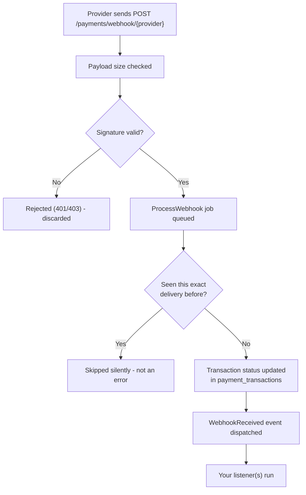

# Webhooks

## What is a webhook, really?

Normally, when your app talks to a payment provider, *you* start the conversation — you call their API to create a charge, and they respond. A webhook flips that around: it's the provider calling *you*, unprompted, to tell you something happened.

Concretely, a webhook is just an HTTP request — the provider's server sends a `POST` request to a URL on your server, with a JSON body describing an event ("this payment succeeded," "this subscription was cancelled," and so on). Your app is a web server already; a webhook endpoint is just one more route that happens to be called by a payment provider instead of a browser.

## Why PayZephyr needs one

We covered the core reason in [Understanding Payment Flow](payment-flow.md): **the redirect back to your callback URL depends on the customer's browser cooperating, and a webhook doesn't.** If a customer pays successfully and then closes their browser tab before the redirect finishes, your app never learns about it through the callback — but the provider still sends the webhook, because that's a server-to-server request that doesn't care what the customer's browser is doing.

There's a second reason webhooks matter beyond one-time payments: **subscriptions change state on their own, with no customer action involved at all.** A subscription renews every month automatically — nobody clicks anything, so there's no callback to catch it. The only way your app finds out a subscription renewed, or that a renewal payment failed, is a webhook. See [Subscriptions](subscriptions.md) for how that connects.

## When webhooks are triggered

Whenever something changes on the provider's side that your app would want to know about — not just "payment succeeded." Depending on the provider and what you're using PayZephyr for, that includes: a payment succeeding or failing, a subscription being created, renewing, or being cancelled, and a subscription's renewal payment failing.

## What happens internally when one arrives

PayZephyr registers a webhook endpoint automatically — you don't create a route yourself. Here's the path a webhook takes through PayZephyr, in order:



Two steps are worth understanding before you write any code:

**Signature verification happens before anything else.** Every provider signs its webhook payloads with a secret only you and the provider know, so PayZephyr can confirm a request genuinely came from the provider — not from someone who found your webhook URL and is sending fake "payment succeeded" requests. An unsigned or incorrectly-signed request never reaches your code at all. Full details in [Security](security.md).

**Processing happens on a queue, not during the HTTP request.** This is why `php artisan queue:work` (or a properly configured queue driver in production) isn't optional — see [Queues](queues.md) for exactly why this matters and what happens if you skip it.

## Setting it up in your provider's dashboard

PayZephyr's webhook URL follows the pattern `https://yourdomain.com/payments/webhook/{provider}`. In each provider's dashboard, under something like "Webhooks" or "Developer settings," add:

| Provider | Webhook URL |
|---|---|
| Paystack | `https://yourdomain.com/payments/webhook/paystack` |
| Stripe | `https://yourdomain.com/payments/webhook/stripe` |
| PayPal | `https://yourdomain.com/payments/webhook/paypal` |
| Flutterwave | `https://yourdomain.com/payments/webhook/flutterwave` |
| Square | `https://yourdomain.com/payments/webhook/square` |
| Monnify | `https://yourdomain.com/payments/webhook/monnify` |
| OPay | `https://yourdomain.com/payments/webhook/opay` |
| Mollie | `https://yourdomain.com/payments/webhook/mollie` |

While developing locally, your machine isn't reachable from the internet, so providers can't reach it either — use a tunneling tool like [ngrok](https://ngrok.com) to expose your local server temporarily, and point the provider's webhook URL at the tunnel's public URL instead.

> **The webhook path is configurable.** If you changed `PAYMENTS_WEBHOOK_PATH` in `.env` (see [Configuration](configuration.md#webhook-settings)), substitute it above.

## Reacting to a webhook

PayZephyr dispatches exactly one Laravel event for every webhook it processes, regardless of which provider sent it: `KenDeNigerian\PayZephyr\Events\WebhookReceived`. You don't need to know each provider's specific event-naming scheme — you listen for this one event and inspect its `provider` property to tell them apart.

```php
// app/Providers/EventServiceProvider.php

use KenDeNigerian\PayZephyr\Events\WebhookReceived;

protected $listen = [
    WebhookReceived::class => [
        \App\Listeners\HandlePaymentWebhook::class,
    ],
];
```

```php
// app/Listeners/HandlePaymentWebhook.php

namespace App\Listeners;

use App\Models\Order;
use KenDeNigerian\PayZephyr\Events\WebhookReceived;

class HandlePaymentWebhook
{
    public function handle(WebhookReceived $event): void
    {
        // $event->provider   - e.g. "paystack"
        // $event->payload    - the provider's raw webhook body, as an array
        // $event->reference  - the payment reference, if PayZephyr could extract one

        if ($event->reference === null) {
            return; // not a payment-status event we recognize a reference for
        }

        $order = Order::where('payment_reference', $event->reference)->first();

        if ($order && $order->status !== 'paid') {
            // Re-verify rather than trusting the webhook payload's status field directly -
            // see Payment Verification for why.
            $verification = \KenDeNigerian\PayZephyr\Facades\Payment::verify($event->reference, $event->provider);

            if ($verification->isSuccessful()) {
                $order->update(['status' => 'paid']);
            }
        }
    }
}
```

Why re-verify inside the listener instead of trusting `$event->payload` directly? By the time your listener runs, PayZephyr has already checked the webhook's *signature* — so you know it genuinely came from the provider — but re-verifying via the API is still worth doing for the same reason described in [Payment Verification](verification.md): it's one extra API call for a guarantee that the data you're acting on reflects the provider's current, authoritative state, not a snapshot from whenever the webhook was generated.

If you're specifically handling subscription lifecycle events (a subscription being created, renewed, cancelled, or a renewal payment failing), PayZephyr dispatches four additional, more specific events for those — see [Events](events.md) for the full catalog and [Subscriptions](subscriptions.md) for how they fit into subscription billing.

## Duplicate deliveries

Providers routinely deliver the same webhook more than once — if your server responds slowly, or a delivery attempt times out on the provider's end, most providers will retry. **This is normal, expected behavior, not a sign something is broken.**

PayZephyr handles this for you: every webhook delivery is checked against a table of previously-processed deliveries (`webhook_events`, created by the migration you ran during [installation](installation.md)) before any side effect runs. A duplicate delivery is recognized and skipped — your `WebhookReceived` listener only fires once per actual event, even if the provider sent the underlying webhook three times. You don't need to write your own deduplication logic for this.

## Local development without signature verification

If you're testing against a provider's sandbox that doesn't send correctly-signed webhooks (rare, but it happens with some sandboxes), you can disable signature verification for local development only:

```env
PAYMENTS_WEBHOOK_VERIFY_SIGNATURE=false
```

**Never do this in an environment with real credentials.** Without signature verification, anyone who discovers your webhook URL can send fake "payment succeeded" events. See [Security](security.md).

## Next steps

- [Events](events.md) — the full list of events PayZephyr dispatches, including the subscription-specific ones
- [Security](security.md) — exactly how signature verification and replay protection work
- [Queues](queues.md) — why webhook processing depends on a running queue worker
